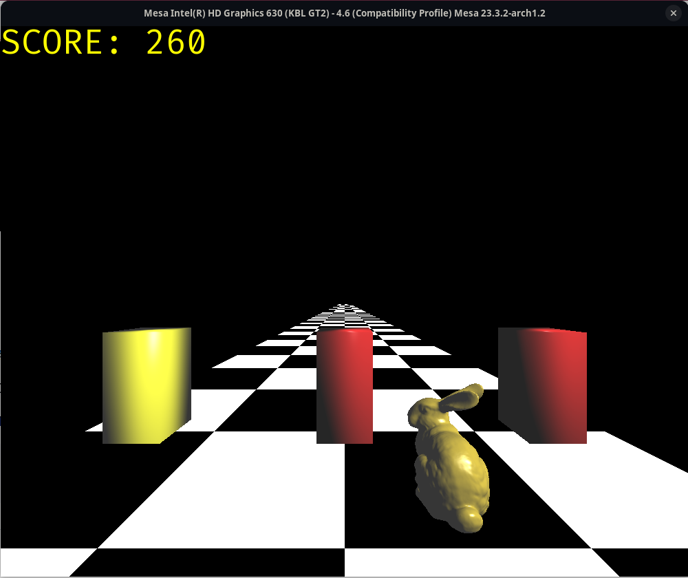

# Bunny Run

Simple game developed with openGL for CENG477 Introduction to Computer Graphics course.

#Running the game

Dependencies:

    glfw
    opengl
    firacode font

To run:

    git clone https://github.com/aeren108/bunny-run.git
    cd bunny-run

    make game
    ./main
